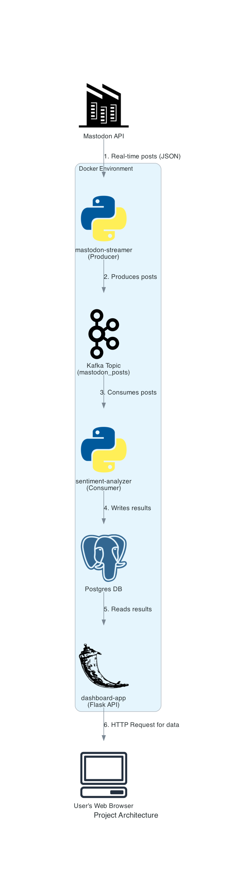

# simple_real_time_sentiment_analysis

A simple streaming web-dashboard to call random posts from Mastodon.social and excute sentiment analysis on them in real-time.

Kafka, PostgreSQL have been used. Flask has been used to draw the dashboard.

Recommended to run it through Docker.
